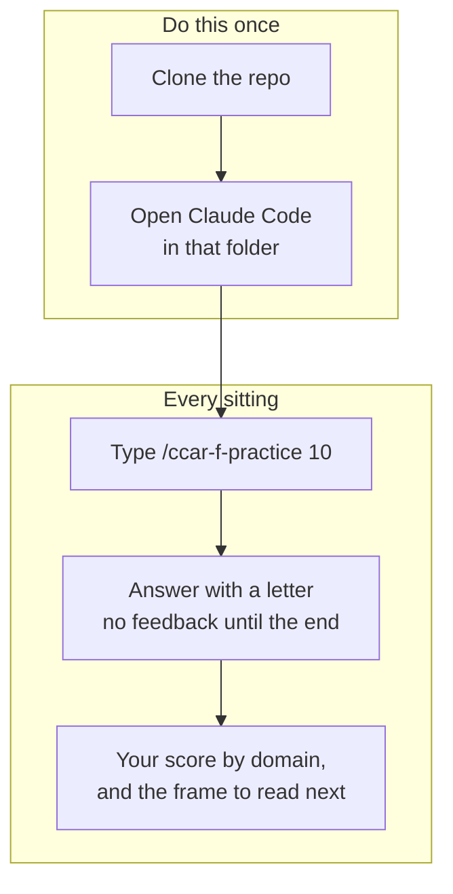
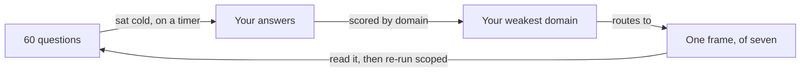

# Claude Certified Architect – Foundations

Two study pieces for the CCAR-F certification, written while preparing for it
and published so they are useful to someone else.

- **[Frame Map](frame-map/)**. A decision framework. Three moves, seven frames,
  three lenses. It is what you read to decide when four options all look
  defensible.
- **[Practice Set](practice-set/)**. 60 original items across the six scenarios
  in the published blueprint, with an explanation for every option and a
  reference to the guide line that supports each key.
- **[Skill](skill/)**. A Claude Code skill that runs the set cold and on a
  timer, scores by domain, and points you at the frame that covers your weakest
  one.

Sitting the set is two commands and no setup, because the skill ships inside the
repository:



> Independent study material. Not affiliated with, endorsed by, or reviewed by
> Anthropic. It reproduces no exam content: every item was written from the
> publicly published task statements in the official
> [Exam Guide](https://anthropic-partners.skilljar.com/claude-certified-architect-foundations-certification), which you should
> read first. The frame and lens names are study scaffolding invented here, not
> official terminology.

## Recommended order

**Sit the practice set first, cold and on a timer, before reading anything
else.** Questions and answers are in separate files precisely so this is
possible. Working through a set with the guide open measures recognition, and
recognition is not the thing that has to hold on the day.

Then read the answers in full, including for the items you got right. Then take
your weakest domain to the Frame Map and read the frame that covers it.



The two pieces are one loop. The questions are not a test you pass, they are the
instrument that tells you which frame to read, and the frame is what changes the
next result. Most study material stops at the first arrow.

## Run it in Claude Code

```bash
git clone https://github.com/Lufeloga/claude-certified-architect-foundations.git
cd claude-certified-architect-foundations
claude
```

The skill ships inside the repository, so there is nothing to install:

```
/ccar-f-practice        # 20 items, cold, timed
/ccar-f-practice 60     # the full set
```

Or just print [the PDFs](practice-set/) and work on paper.

## Verify the material rather than trusting it

Every claim this repository makes about its own quality is measurable, and the
tools that measure it are here.

```bash
python3 tools/audit_keys.py        # is the answer key statistically clean?
python3 tools/heuristic_solver.py  # can the set be beaten without reading it?
python3 tools/lint_prose.py        # spelling, terminology, personal data
python3 tools/build.py             # regenerate every format from the JSON
```

[QUALITY.md](QUALITY.md) reports what those tools return, before and after the
set was rebuilt. The headline: a program that always picked the longest option
used to score **72%** on this set without reading a single question. It now
scores 26%, which is chance.

## How it fits together

`practice-set/questions.json` is the only editable copy. The Markdown, the HTML,
and the PDF are generated from it by `tools/build.py`, and editing them by hand
is a change the next build reverts.

```
frame-map/      README.md, printable PDF, and the HTML the PDF comes from
practice-set/   questions.json (source), plus generated MD, HTML and PDF
skill/          notes on the runner; the skill itself is in .claude/skills/
tools/          build and verification scripts, no dependencies
```

## Found a mistake?

In sixty items, there will be some. Corrections are the reason this is a
repository rather than a PDF. See [CONTRIBUTING.md](CONTRIBUTING.md): the ask is
an item number, the answer you believe is right, and the line of the official
guide that supports it.

## License

[CC BY 4.0](LICENSE). Use it, adapt it, teach from it, including commercially.
Keep the attribution.

**Attribution:** Luis Lopez Galarza ([@Lufeloga](https://github.com/Lufeloga)),
*Claude Certified Architect – Foundations study kit*, CC BY 4.0.

The license covers the material in this repository. It does not cover the
official Exam Guide, which belongs to Anthropic and is linked, never reproduced.
